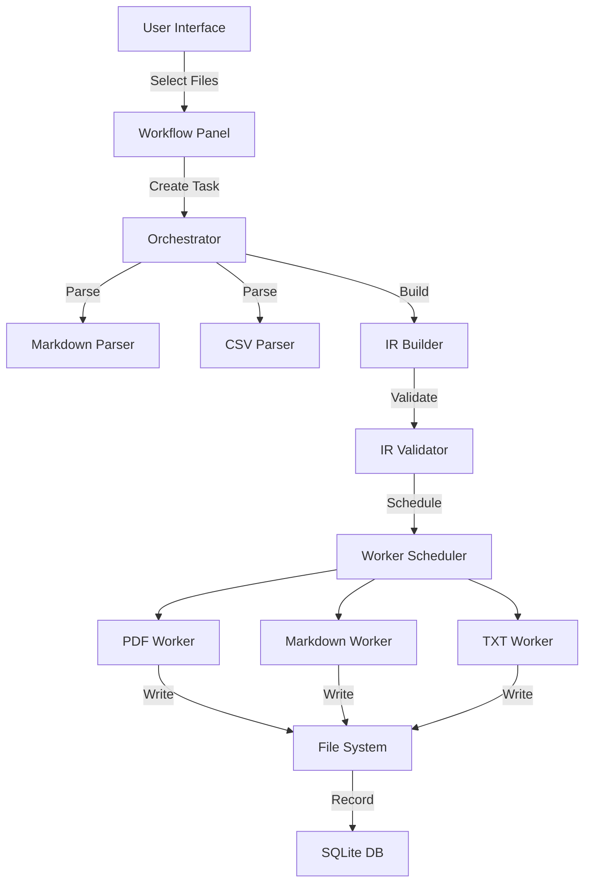

# System Architecture

## Overview

This document describes the high-level architecture of the Papyrus document transformation system.

## Component Diagram

## Data Flow

The system processes documents through a multi-stage pipeline:

1. **Input Stage** — User selects source files via the UI
2. **Parsing Stage** — Format-specific parsers convert raw content into a structured Intermediate Representation (IR)
3. **IR Stage** — The IR is validated and enriched with metadata (headings, sections, tables, diagrams)
4. **Worker Stage** — Parallel workers transform the IR into target formats
5. **Export Stage** — Output files are written to disk and recorded in the database

## Key Design Decisions

### Why IR?

The Intermediate Representation serves as the lingua franca between input and output formats. Instead of writing N×M converters (one for each input-output pair), we write N parsers and M workers, reducing complexity from O(NM) to O(N+M).

### Why Offline-First?

Document transformation often involves sensitive content — legal contracts, financial reports, medical records. By processing everything locally, we eliminate privacy risks associated with cloud processing and remove dependency on internet connectivity.

### Why SQLite?

SQLite provides a robust, zero-configuration embedded database that requires no server process. It handles concurrent reads well and provides ACID guarantees for workspace metadata.

## Worker Architecture

Each worker operates independently:

| Worker | Input | Output | Technology |
|--------|-------|--------|------------|
| PDF Worker | IR | PDF | Electron printToPDF |
| Markdown Worker | IR | .md | IR Serializer |
| TXT Worker | IR | .txt | Plain text renderer |
| HTML Converter | Raw | .html | Custom HTML generator |
| DOCX Converter | Raw | .docx | Office Open XML |

## Future Enhancements

- **Image Worker** — Extract and embed images from documents
- **EPUB Worker** — Generate electronic book format
- **LaTeX Worker** — Generate LaTeX source for academic documents
- **AI Enhancement** — Local LLM for document summarization and enhancement

---

*Architecture documentation for Papyrus*
